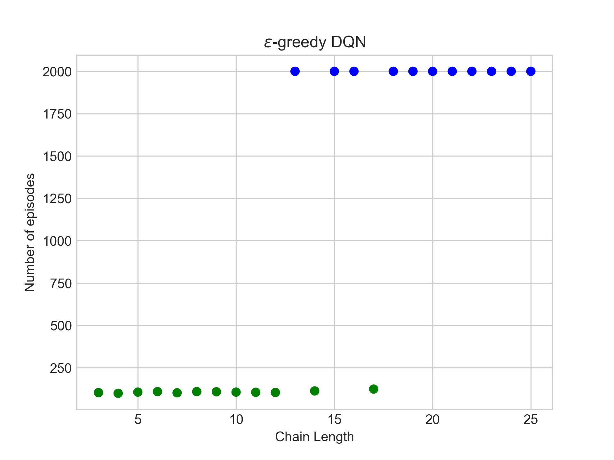

# Markov Chain DQNs

This is a tensorflow based implementation of the Markov n-chain experiment from the [BootstrappedDQN](https://papers.nips.cc/paper/6501-deep-exploration-via-bootstrapped-dqn) paper. The same experiment has also been used in [Parameter Space Noise for Exploration](https://openreview.net/forum?id=ByBAl2eAZ) and more recently in [Randomized Priors for Deep Reinforcement Learning](https://arxiv.org/abs/1806.03335).

The basic DQN network has been setup and the result has been reproduced for up to chains of length 25 in the figure below.

### TODO
- [ ] BootstrappedDQN
- [ ] Parameter Space Noise
